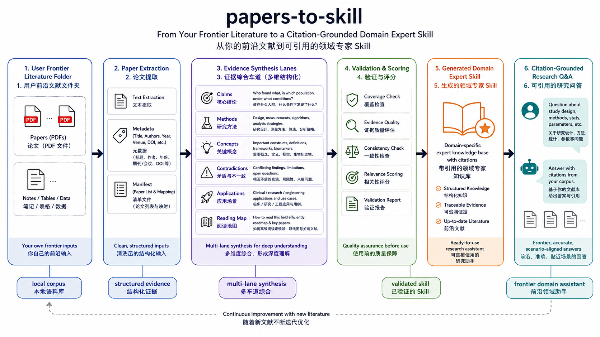
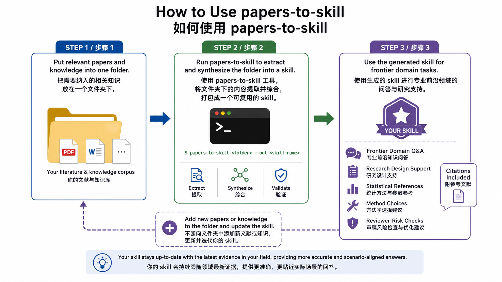
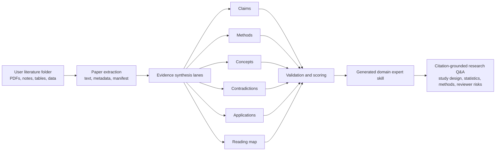
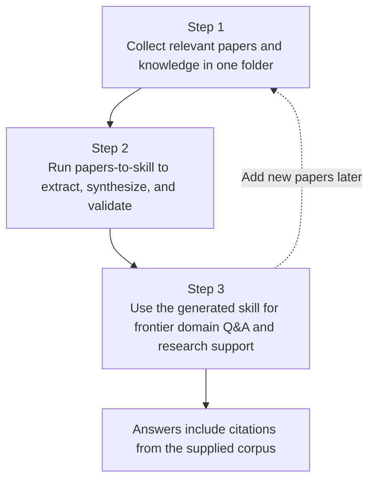

# Papers To Skill

> Turn your frontier literature folder into a citation-grounded domain expert skill.<br>
> 把你的前沿文献文件夹，变成一个可引用的领域研究助手 Skill。


`papers-to-skill` converts a folder of academic papers and related research knowledge into a reusable, citation-grounded domain expert skill.

- [English](#english)
- [中文](#中文)
- [Architecture](#architecture)
- [Usage Workflow](#usage-workflow)

## Image2 Visual Overview

The diagrams below were generated with Image2 to show the skill architecture and the practical usage flow.





## Why This Exists

General AI is often strong at reasoning, but weak answers in frontier academic fields are frequently caused by missing domain-specific prior knowledge. The model may not know the newest papers, the latest parameter conventions, the most relevant negative results, or what reviewers in a narrow field currently care about.

`papers-to-skill` is designed to close that gap by letting users bring their own literature corpus. Instead of asking a general model to answer from broad training memory, you first package your field-specific papers into a skill, then use that skill for grounded consultation.

## See It In Action

```text
User
  I want to run a regression analysis on coronary calcium score.
  Help me find statistical references.

Generated domain skill
  Use log(CACS + 1) for skewed continuous CACS,
  and use CACS > 400 as a sensitivity or binary-risk analysis
  when aligned with the endpoint.

  Evidence:
  - paper A used CACS as a predictor in a multivariable model.
  - paper B used CACS > 400 as a high-risk threshold.
  - paper C compared CACS with inflammatory imaging biomarkers.

  References:
  - paper-key-a
  - paper-key-b
  - paper-key-c
```

The point is not roleplay. The generated skill answers through the concepts, methods, evidence, contradictions, and citation map distilled from the user's own literature folder.

## Architecture



## Usage Workflow



## English

### What It Does

`papers-to-skill` helps users package their own frontier literature corpus into a domain research assistant skill.

The generated skill is intended for later consultation on:

- research idea evaluation
- study design
- parameter and statistical references
- method selection
- evidence lookup
- reviewer-risk checks
- domain-specific Q&A with citations

It combines three patterns:

- **book-to-skill style extraction**: turn papers into structured evidence instead of raw text dumps
- **nuwa-skill style synthesis**: distill the corpus through multiple evidence lanes
- **darwin-skill style validation**: score and revise the generated skill before treating it as usable

### Three-Step Quick Start

1. **Put the knowledge you want to include into one folder.**

   This folder can contain the papers or related research materials you want the generated skill to use as its evidence base.

   ```text
   my-research-corpus/
   +-- paper-01.pdf
   +-- paper-02.pdf
   +-- paper-03.pdf
   ```

2. **Use this tool to package that folder into a skill.**

   Start by extracting the paper corpus:

   ```bash
   python scripts/extract_papers.py <pdf-or-folder> --out <workdir>
   ```

   Then follow `SKILL.md` to synthesize the extracted evidence into a domain expert skill.

3. **Use the generated skill for frontier domain Q&A and research tasks.**

   Example prompts:

   ```text
   Use <generated-skill-name> to evaluate this research design and cite supporting papers.
   Use <generated-skill-name> to find statistical references for this parameter.
   Use <generated-skill-name> to identify reviewer risks in this study idea.
   ```

### What Gets Distilled

The generated expert skill is built from six evidence lanes:

| Lane | What it extracts |
|---|---|
| Claims | Major findings, hypotheses, and evidence strength |
| Methods | Study design, datasets, metrics, statistical models, algorithms |
| Concepts | Definitions, taxonomies, assumptions, and relationships |
| Contradictions | Negative results, disagreements, boundary conditions |
| Applications | How the evidence changes research decisions or agent behavior |
| Reading map | Where to look when answering future questions |

### Honest Boundaries

Every generated skill should state what it cannot do:

- it is only as current as the supplied corpus
- it should not invent citations, thresholds, sample sizes, or effect sizes
- it should distinguish strong evidence from weak or single-paper evidence
- it should not treat model output as clinical, legal, or financial advice
- it should cite the source papers for substantive claims

### Output Shape

```text
<skill-name>/
+-- SKILL.md
+-- references/
    +-- research/
        +-- 01-claims.md
        +-- 02-methods.md
        +-- 03-concepts.md
        +-- 04-contradictions.md
        +-- 05-applications.md
        +-- 06-reading-map.md
    +-- papers.md
    +-- evidence-table.md
    +-- concepts.md
    +-- methods.md
    +-- contradictions.md
    +-- reading-map.md
    +-- validation-report.md
```

### Citation Rule

Every substantive answer from a generated expert skill should include paper references from `references/papers.md`.

## 中文

### 这个工具做什么

`papers-to-skill` 可以把一个文件夹中的学术论文和相关研究知识，转换成一个可复用、带文献来源的垂直领域研究助手 skill。

生成后的 skill 可以用于后续咨询，例如：

- 研究想法评估
- 研究设计
- 参数选择
- 统计方法参考
- 方法学选择
- 证据查找
- 审稿风险检查
- 带文献来源的专业问答

它结合了三类能力：

- **类似 book-to-skill**：把论文提取成结构化证据，而不是简单堆叠原文
- **类似 nuwa-skill**：从多个证据通道综合文献
- **类似 darwin-skill**：在生成后进行验证、评分和修正，确保生成的 skill 可用

### 为什么需要它

在很多真实科研场景中，我们需要的专业知识往往和通用领域知识存在差距。模型训练获得的知识也可能与垂直领域最新文献之间存在时间差和专业差。

当我们直接使用通用型 AI 进行对话时，回答往往不能贴近最前沿的学术研究领域；这并不是模型的智力水平不够，而是它缺乏相关领域的前置知识。

因此，这个工具的目标是把用户自己相关领域的前沿文献打包成一个可复用的研究助手 skill。基于这个研究助手生成的回答，可以结合该领域最新证据、方法和参数参考，给出更真实、更贴近具体场景的建议。

### 三步快速使用

1. **把需要纳入的相关知识放在一个文件夹下。**

   这个文件夹可以放入你希望 skill 学习和引用的论文 PDF 或其他相关研究材料。

   ```text
   my-research-corpus/
   +-- paper-01.pdf
   +-- paper-02.pdf
   +-- paper-03.pdf
   ```

2. **使用这个工具把文件夹下的文件打包成 skill。**

   先运行提取脚本：

   ```bash
   python scripts/extract_papers.py <pdf-or-folder> --out <workdir>
   ```

   然后按照 `SKILL.md` 中的流程，把提取出来的文献证据综合成一个领域专家 skill。

3. **使用生成的 skill 进行专业前沿知识问答或其他研究需求。**

   示例：

   ```text
   使用 <generated-skill-name>，帮我评估这个研究设计，并给出文献来源。
   使用 <generated-skill-name>，帮我查找某个参数或统计方法的参考。
   使用 <generated-skill-name>，帮我判断这个研究想法可能会被审稿人质疑的地方。
   ```

### 它会提取什么

生成的领域专家 skill 由六个证据通道构成：

| 通道 | 提取内容 |
|---|---|
| 核心结论 | 主要发现、假设、证据强度 |
| 研究方法 | 研究设计、数据集、指标、统计模型、算法 |
| 关键概念 | 定义、分类、假设、概念关系 |
| 矛盾与边界 | 阴性结果、冲突发现、适用边界 |
| 应用场景 | 文献如何改变研究决策或 agent 行为 |
| 阅读地图 | 后续回答问题时应该查哪篇文献、哪个部分 |

### 诚实边界

每个生成的 skill 都应该明确说明自己做不到什么：

- 它的知识更新程度取决于用户提供的文献库
- 它不能编造引用、阈值、样本量或效应量
- 它需要区分强证据和单篇论文的弱证据
- 它不能把模型回答当作临床、法律或金融建议
- 它在回答实质性问题时必须给出文献来源

### 输出结构

```text
<skill-name>/
+-- SKILL.md
+-- references/
    +-- research/
        +-- 01-claims.md
        +-- 02-methods.md
        +-- 03-concepts.md
        +-- 04-contradictions.md
        +-- 05-applications.md
        +-- 06-reading-map.md
    +-- papers.md
    +-- evidence-table.md
    +-- concepts.md
    +-- methods.md
    +-- contradictions.md
    +-- reading-map.md
    +-- validation-report.md
```

### 引用规则

生成后的专家 skill 在回答实质性问题时，应该引用 `references/papers.md` 中的文献来源。
